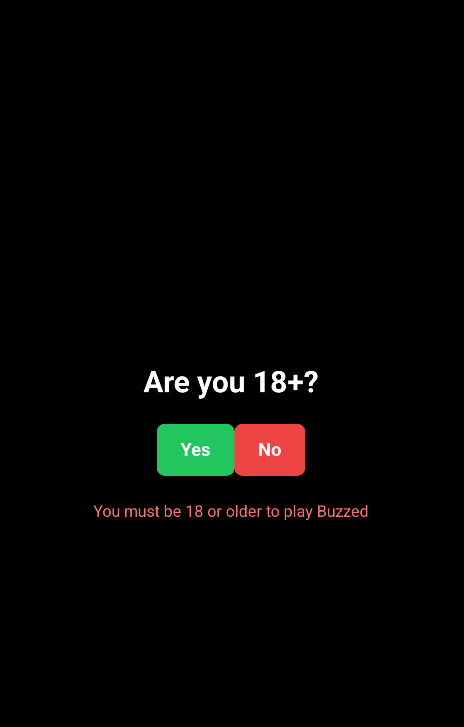
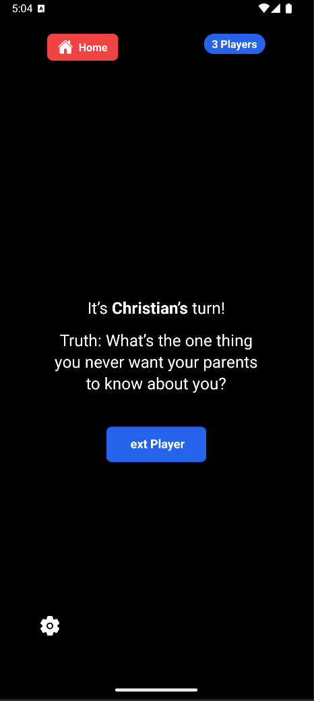
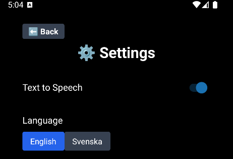

# Party Games App

A mobile party game app built with [Expo](https://expo.dev) and React Native.  
It includes multiple classic party games with **Text-to-Speech (TTS)** support and **multilingual support (English/Swedish)**.

## Screenshots








## 🕹️ Games Included

- **Never Have I Ever**
- **Would You Rather**
- **Most Likely To**
- **Truth or Consequence**
- **8 Seconds Challenge**

## Features

- **Text-to-Speech (TTS)** in both English and Swedish
- **Multilingual support** – switch language directly in the app
- **Sound effects** (start/stop in 8 Seconds Challenge)
- Works on both iOS and Android
- Smooth animations and haptic feedback

## Getting Started

1. Install dependencies:
   ```bash
   npm install
   ```
2. Start the app

```bash
npx expo start
```
